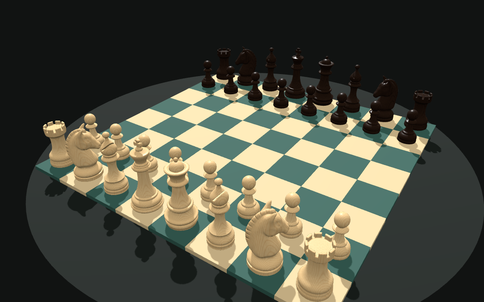

# Quantum Chess Game

Quantum Chess Game is an offline 3D chess game credited to [Quantum Billing LLC](https://qb-solutions.us/).

The game is built with Three.js, `chess.js`, Stockfish, Vite, and Tauri v2. It supports browser play, desktop builds, Android, iOS project generation, Stockfish computer play, and LLM-driven play through a browser agent API.

The Android package id and iOS bundle id are `com.quantumbilling.quantumchess`.

## Play Online

**[▶ Play Quantum Chess in your browser](https://codejq.github.io/quantum-chess-game/game/)**. There's nothing to install: pick a white piece, choose a highlighted square, and play against Stockfish.

The project website is at [codejq.github.io/quantum-chess-game](https://codejq.github.io/quantum-chess-game/), with downloads for desktop and Android.

[](https://codejq.github.io/quantum-chess-game/game/)

## Chess Pieces

The board uses a professionally sculpted Staunton set: a carved horse-head knight with mane and eyes, a slit bishop mitre, a crenellated rook, a pearl-crowned queen, and a cross-topped king. The pieces keep the game's clean white and black finish, with a normal map for the carved detail. Knights face the opponent, turned slightly so their profile shows from the table view.

The model loads from `web/public/models/staunton-pieces.glb` (about 0.9 MB) and ships with every build, so the game stays fully offline. If the model cannot load, the game falls back to built-in Staunton-style pieces drawn in code.

## Development

```powershell
npm ci
npm run dev
```

## Build

```powershell
npm test
npm run test:offline-build
npm run build
npm run tauri:build
```

## Company Credit

Quantum Chess Game is credited to [Quantum Billing LLC](https://qb-solutions.us/).

The 3D chess pieces are from [Chess Set](https://polyhaven.com/a/chess_set) by Riley Queen on Poly Haven, released under CC0. `web/public/models/staunton-pieces.glb` keeps only one mesh per piece type and the normal map.

## LLM Play

The browser game exposes `window.quantumChessAgent` so an LLM or automation tool can observe the board, inspect legal moves, and play chess moves.

```js
window.quantumChessAgent.observe()
window.quantumChessAgent.act({ type: 'move', from: 'e2', to: 'e4' })
window.quantumChessAgent.act({ type: 'san', move: 'Nf3' })
```
